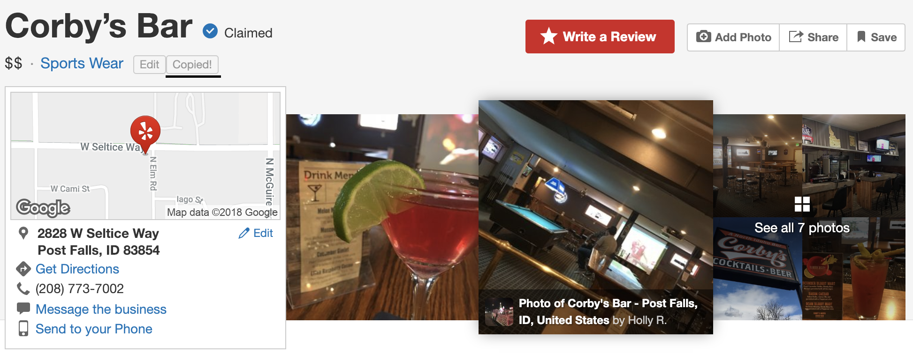
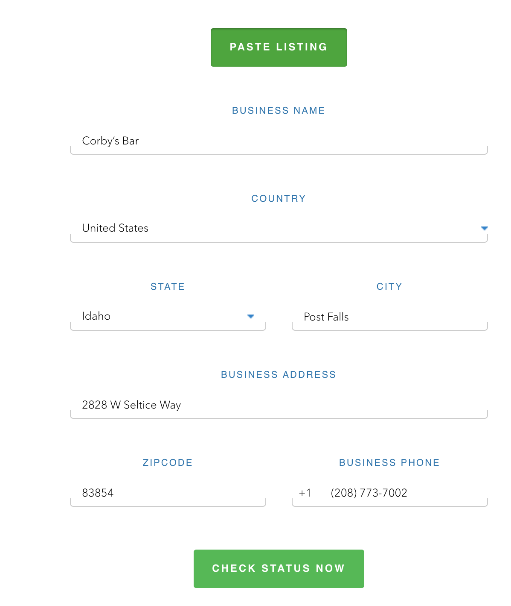

# Synup-Copy
Chrome extension to copy listing data from yelp and paste it in Synup Scan dashboard.

### Installation

1. Clone the project locally.
2. Open the Extension Management page by navigating to chrome://extensions. The Extension Management page can also be opened by clicking on the Chrome menu, hovering over More Tools then selecting Extensions.
3. Enable Developer Mode by clicking the toggle switch next to Developer mode.
4. Click the LOAD UNPACKED button and select the extension directory.

### Screenshots
* Copy the listing details by clicking the copy listing button

* Click the paste listing button to paste the listing details in Synup scan
